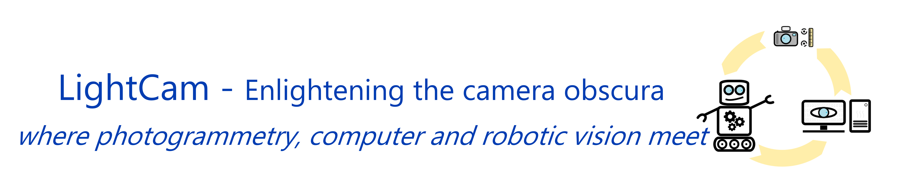

# 

LightCam, Enlightening the camera obscura - where photogrammetry, computer vision and robotics meet, is a project funded by ISPRS Educational and Capacity Initiatives. Its aim is to ease the dialog among these three actors with two intermediation tools:
1. a [knowledge base website](https://lightcam.fbk.eu/)
2. a code repository

This repository contains piece of codes to transform from one common mathematical representation to another (e.g., different angle definitions, from one coordinate system to another,  etc.). It will also show examples for the conversion between different software applications adopting different implementation strategies (e.g., Bingo, Photomodeler, Australis, OpenCV, etc.) and format files (.nvm, .out, etc.). It also contains the code for the implementation of the back end and front end of the knowledge base website.
The developers of the different codes are explicitly named. Thanks are addressed to all those who have decided to share their work here.

Anyone wishing to contribute their work can contact us. We will be happy to share it with the scientific community through this platform.

## Contacts

"Contact Us" form: https://lightcam.fbk.eu/about
